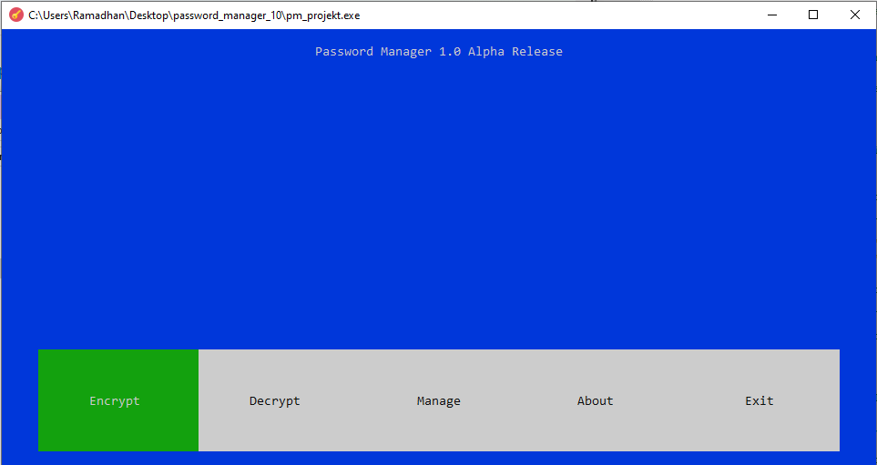
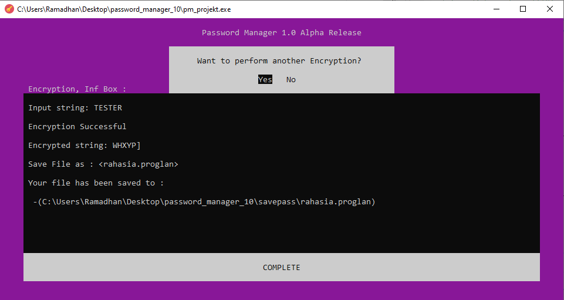
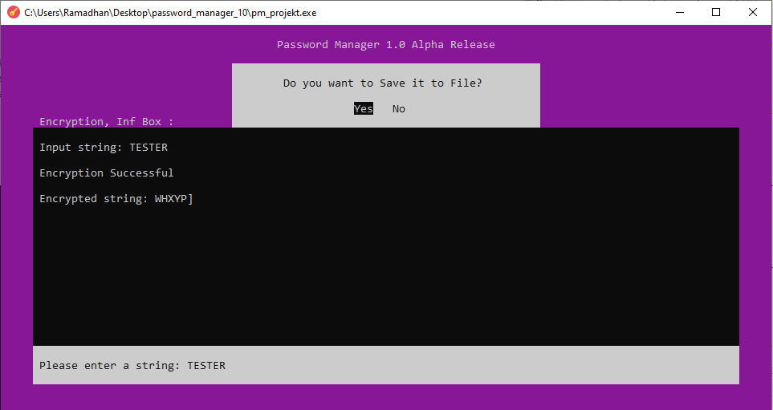
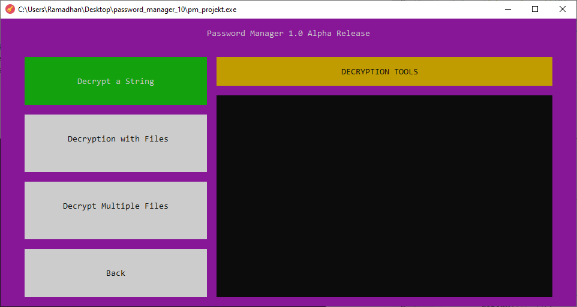
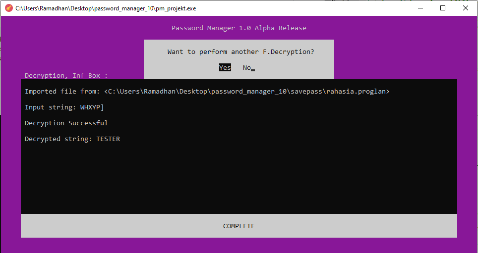
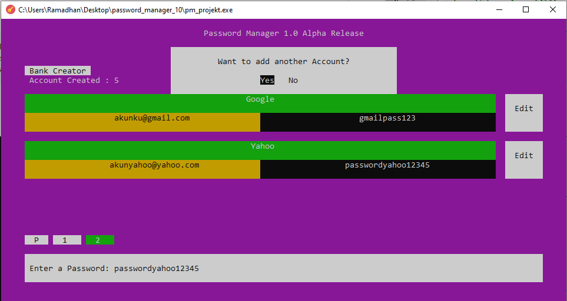
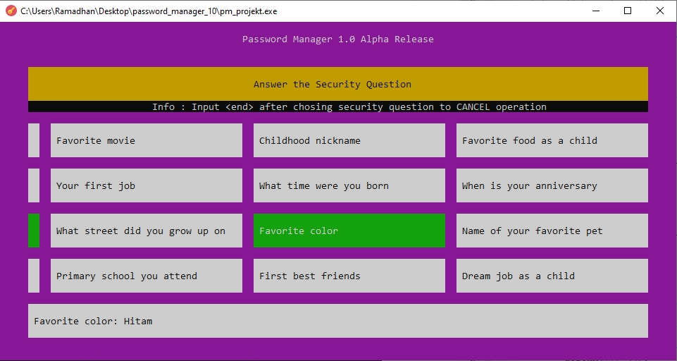
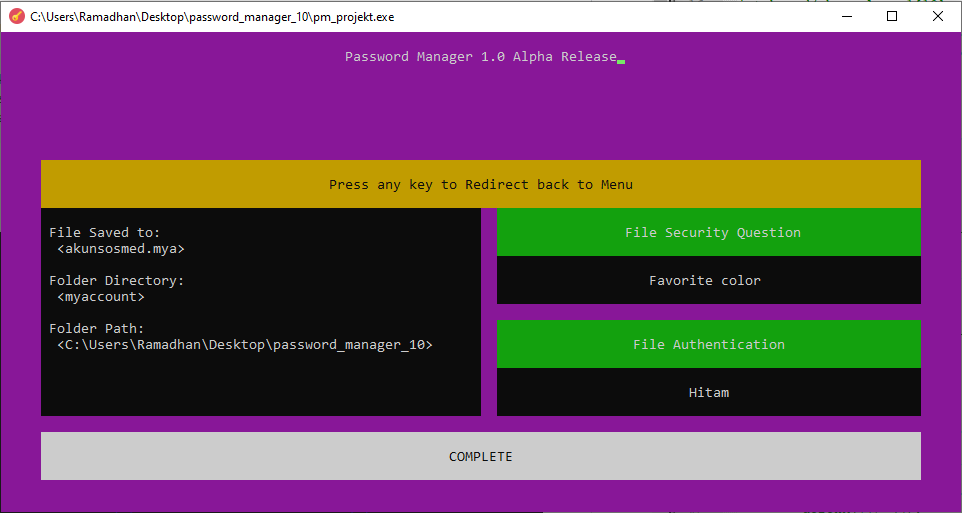
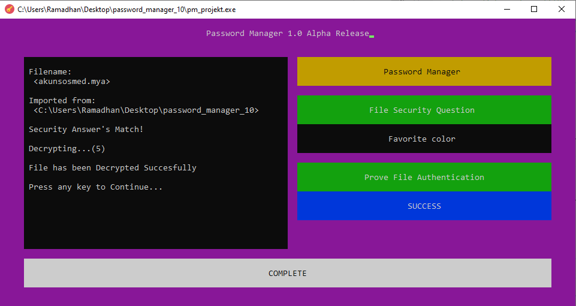
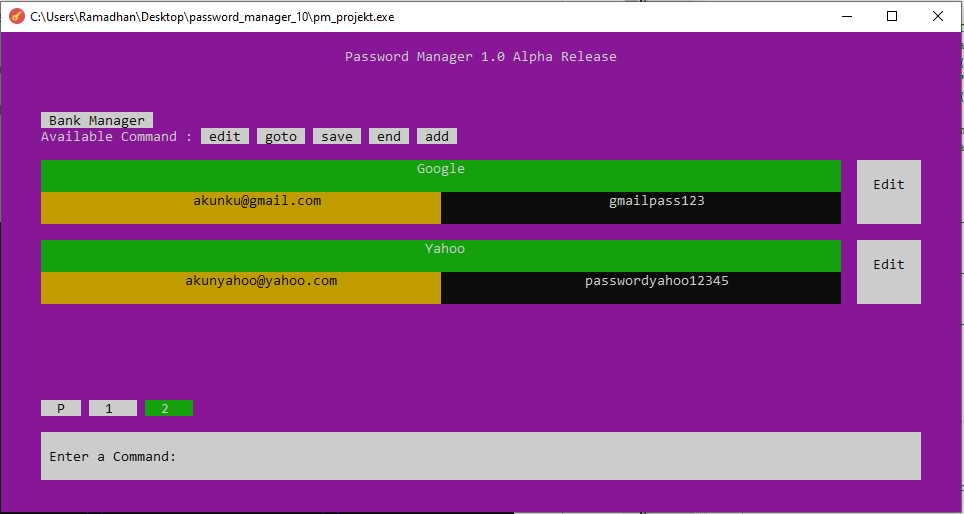

# Password Manager (Kelompok 14)

Dibuat oleh :
Ramadhan Kalih Sewu (1806148826) dan
Diaz Ilyasa Azrurrafi Saiful (1806200154)

## User Interface
- Classic Terminal-Base Program, <windows.h> only for Windows User
- Improve Text User Interface using <curses.h>
- Minimalist Design



### Using Curses.H
```bash
    //Menjalankan Ncurses
    initscr();
    cbreak();
```

### Create Window in Curses.H
```bash
    WINDOW *win;
    win = newwin(YLength, XLength, YCoord, XCoord);
    refresh();
    wrefresh(win);
```

## Cakupan Program
- ASCII Shifter (Using Array) for Encrypt and Decrypt
- File Pointer (fopen in <windows.h>) for Saving, Importing, and Modify File


### Encrypt
- View

```bash
      for(i = 0; (i < sz && str[i] != '\0'); i++)
      {
        if (i<2)
            str[i] = str[i] + 3;
        else if (i<4)
            str[i] = str[i] + 5;
        else if (i<6)
            str[i] = str[i] + 11;
        else if (i<8)
            str[i] = str[i] - 7;
        else if (i<10)
            str[i] = str[i] - 10;
        else if (i>=10)
            str[i] = str[i] + 1 + i;
      }
```

### Decrypt
- Feature

- View

```bash
      for(i = 0; (i < sz && str[i] != '\0'); i++)
      {
        if (i<2)
            str[i] = str[i] - 3;
        else if (i<4)
            str[i] = str[i] - 5;
        else if (i<6)
            str[i] = str[i] - 11;
        else if (i<8)
            str[i] = str[i] + 7;
        else if (i<10)
            str[i] = str[i] + 10;
        else if (i>=10)
            str[i] = str[i] - 1 - i;
      }
```

### Write or Read Files
```bash
        //Ambil nama File
        mvwprintw(inputwin, 1, 1, "Simpan dengan nama file: ");
        wrefresh(inputwin);
        wgetstr(inputwin, filename);

        //Specify path
        char cwd[PATH_MAX];
        getcwd(cwd, sizeof(cwd));
        dirname = "myaccount";
        sprintf(filepath, "%s\\%s\\%s.mya", cwd, dirname, filename);

        //Exporting File
        fptr = fopen(filepath, "w"); //W to Write, R to Read
 ```
 
 ### Create Bank Password
- View

- Security Question

- File Encrypted


### Manage Bank Password
- Prove File Authentication

- View
You can Edit existing data , Add new Data, Change page view, Save changes to the file. 


